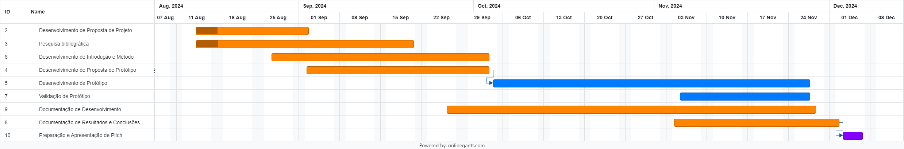

# JornadaTemperlandia

# Referências
Normas vidreiras:
- [NBR 14698](https://abravidro.org.br/abntcb-37-avanca-nos-trabalhos-de-revisao-da-nbr-14698/)
- [O que é um sistema SCADA?](https://www.hitecnologia.com.br/o-que-e-um-sistema-scada/) 
- [Supervisory Control and Data Acquisition Approach in Node-RED. Application and Discussions](./bibliografia/Supervisory_Control_and_Data_Acquisition_Approach_.pdf)
- [Node Red](https://nodered.org/)
- ModBus + MQTT

## Tracebility
- [Eclipse TractusX Traceability FOSS](https://github.com/eclipse-tractusx/traceability-foss)
- [Tecnipesa Industrial Labelling Machines](https://www.tecnipesa.com/en/products/industrial-labelling-machines)
- [Gravotech Product Traceability](https://www.gravotech.com/articles/product-traceability)
- [Grafana: Industrial IoT Visualization](https://grafana.com/blog/2024/07/01/industrial-iot-visualization-why-united-manufacturing-hub-chose-grafana-to-power-its-iiot-platform/)

Palavras chaves: Sistema de Supervisão e Aquisição de Dados,

# Introdução
    Esse artigo busca explorar possibilidades de solução para rastreabilidade de produção, focando na identificação de status de recursos produtivos, erros de produção e estoques gerados de recursos com imperfeições que podem ser reutilizados. A pesquisa é feita em parceria com a indústria vidreira de Londrina, Terperlândia, que produz diferentes peças em vidro e têmperas.
    A solução a ser apresentada busca trazer maior assertividade de onde estão os recursos de pedidos, pois as peças tem um rastreio limitado apenas a quando entram na máquina, faltando uma visão global e sistemática de falhas, recursos parados, atrasos de produção e perdas. O objetivo é trazer a luz maneiras de agilizar o processo produtivo e trazer maior controle sobre perdas de recursos que podem ser reutilizados. 
    Introduzindo ao processo mais formas de controle do estoque, a principal modificação será a inserção de 3 etapas de verificação no processo atual, o mesmo atualmente apenas faz a verificação de itens do pedido na hora que antecede a entrega final ao consumidor, promovendo uma falha de ter que parar todo o processo produtivo contínuo e escolher entre procurar o objeto perdido ou refazer em um próximo lote.
    Para alcançar esse objetivo, nosso projeto implementará um Sistema de Supervisão e Aquisição de Dados (SCADA), que permitirá uma interface de controle detalhada para cada pedido produzido. Essa interface será interativa, permitindo que o operador clique em um pacote específico e seja direcionado para uma tela que detalha o conteúdo e status daquele lote. Isso trará maior visibilidade e controle em tempo real, assegurando que cada lote seja gerido de forma eficiente e transparente à todo momento do processo industrial.

# Mercado
- **GlassControl**: registra todas as ocorrências de não conformidades ocorridas durante o processo produtivo, principalmente quebras de chapas no estoque. Produz indicadores de qualidade, relatórios e gráficos de ocorrências. - Pode registrar os retalhos/sobras gerados e indica quais peças estão disponíveis para otimização/corte e que cabem no retalho gerado, com isto, diminui a quantidade de retalhos gerados e ainda agiliza a produção.

# Cronograma

### 1. Desenvolvimento de Proposta de Projeto
**Datas:** 14/08/2024 – 02/09/2024  
**Duração:** 14 dias  
**Descrição:** Proposta inicial para o projeto. Escopo, Objetivos, Recursos necessários. A proposta deve identificar os problemas a serem resolvidos, os benefícios esperados e as principais metas do projeto. Plano de trabalho básico.

### 2. Pesquisa Bibliográfica
**Datas:** 14/08/2024 – 20/09/2024  
**Duração:** 28 dias  
**Descrição:** Pesquisa detalhada sobre soluções existentes, teorias relevantes e tecnologias aplicáveis ao controle de produção. Revisar artigos acadêmicos, Relatórios Técnicos e outras fontes.

### 3. Desenvolvimento de Introdução e Método
**Datas:** 27/08/2024 – 03/10/2024  
**Duração:** 28 dias  
**Descrição:** Redigir a Introdução e Método do projeto. Introdução deve fornecer uma visão geral do problema, a importância do projeto e os objetivos. A seção de Método deve detalhar as abordagens que serão usados para desenvolver e validar a solução. Isso inclui a descrição de processos, técnicas e ferramentas a serem utilizados.

### 4. Desenvolvimento de Proposta de Protótipo
**Datas:** 02/09/2024 – 03/10/2024  
**Duração:** 24 dias  
**Descrição:** Proposta detalhada para o protótipo do sistema de controle de produção. Design preliminar do protótipo, especificações técnicas e um plano de desenvolvimento. A proposta deve definir claramente como o protótipo atenderá aos requisitos do projeto e como será implementado e testado.

### 5. Desenvolvimento de Protótipo
**Datas:** 04/10/2024 – 27/11/2024  
**Duração:** 39 dias  
**Descrição:** Construir o protótipo com base na proposta desenvolvida. Isso inclui a implementação de solução, integração de componentes e desenvolvimento das funcionalidades principais. Durante esta fase, testes iniciais serão realizados para garantir que o protótipo está funcionando conforme o esperado e pode ser ajustado conforme necessário.

### 6. Validação de Protótipo
**Datas:** 05/11/2024 – 27/11/2024  
**Duração:** 17 dias  
**Descrição:** Realizar testes detalhados para validar a eficácia do protótipo e qual sua eficiência. Isso envolve verificar se o protótipo atende aos requisitos do projeto e realizar ajustes baseados no feedback dos testes. A validação é crucial para garantir que o protótipo esteja pronto para a implementação completa e possa atender às necessidades do controle de produção de forma eficiente.

### 7. Documentação de Desenvolvimento
**Datas:** 26/09/2024 – 28/11/2024  
**Duração:** 46 dias  
**Descrição:** Compilar toda a documentação relacionada ao desenvolvimento do projeto, incluindo especificações técnicas, códigos fonte, diagramas e registros de testes. Esta documentação é importante para garantir a continuidade do projeto e facilitar futuras manutenções ou atualizações.

### 8. Documentação de Resultados e Conclusões
**Datas:** 04/11/2024 – 02/12/2024  
**Duração:** 21 dias  
**Descrição:** Redigir o Relatório dos resultados do projeto, incluindo a análise dos dados obtidos, as conclusões sobre a eficácia do protótipo e recomendações para futuras melhorias. Apresentar uma visão clara dos sucessos e desafios encontrados durante o desenvolvimento.

### 9. Preparação e Apresentação de Pitch
**Datas:** 03/12/2024 – 06/12/2024  
**Duração:** 4 dias  
**Descrição:** Preparar e realizar Apresentação em formato Stakeholders. Deve resumir os principais aspectos do projeto, incluindo a proposta, desenvolvimento, resultados e benefícios.
