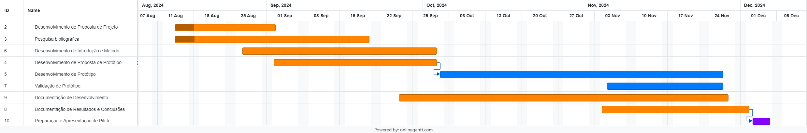

# JornadaTemperlandia

# Referências
Normas vidreiras:
- [NBR 14698](https://abravidro.org.br/abntcb-37-avanca-nos-trabalhos-de-revisao-da-nbr-14698/)
- [O que é um sistema SCADA?](https://www.hitecnologia.com.br/o-que-e-um-sistema-scada/) 
- [Supervisory Control and Data Acquisition Approach in Node-RED. Application and Discussions](./bibliografia/Supervisory_Control_and_Data_Acquisition_Approach_.pdf)
- [Node Red](https://nodered.org/)
- ModBus + MQTT

## Tracebility
- [Eclipse TractusX Traceability FOSS](https://github.com/eclipse-tractusx/traceability-foss)
- [Tecnipesa Industrial Labelling Machines](https://www.tecnipesa.com/en/products/industrial-labelling-machines)
- [Gravotech Product Traceability](https://www.gravotech.com/articles/product-traceability)
- [Grafana: Industrial IoT Visualization](https://grafana.com/blog/2024/07/01/industrial-iot-visualization-why-united-manufacturing-hub-chose-grafana-to-power-its-iiot-platform/)

Palavras chaves: Sistema de Supervisão e Aquisição de Dados,

# Introdução  
  Esse artigo busca explorar possibilidades de solução para rastreabilidade de produção, focando na identificação de status de recursos produtivos, erros de produção e estoques gerados de recursos com imperfeições que podem ser reutilizados. A pesquisa é feita em parceria com a indústria vidreira de Londrina, Terperlândia, que produz diferentes peças em vidro e têmperas.
  A solução a ser apresentada busca trazer maior assertividade de onde estão os recursos de pedidos, pois as peças tem um rastreio limitado apenas a quando entram na máquina, faltando uma visão global e sistemática de falhas, recursos parados, atrasos de produção e perdas. O objetivo é trazer a luz maneiras de agilizar o processo produtivo e trazer maior controle sobre perdas de recursos que podem ser reutilizados. 
  Introduzindo ao processo mais formas de controle do estoque, a principal modificação será a inserção de 3 etapas de verificação no processo atual, o mesmo atualmente apenas faz a verificação de itens do pedido na hora que antecede a entrega final ao consumidor, promovendo uma falha de ter que parar todo o processo produtivo contínuo e escolher entre procurar o objeto perdido ou refazer em um próximo lote.
  Para alcançar esse objetivo, nosso projeto implementará um Sistema de Supervisão e Aquisição de Dados (SCADA), que permitirá uma interface de controle detalhada para cada pedido produzido. Essa interface será interativa, permitindo que o operador clique em um pacote específico e seja direcionado para uma tela que detalha o conteúdo e status daquele lote. Isso trará maior visibilidade e controle em tempo real, assegurando que cada lote seja gerido de forma eficiente e transparente à todo momento do processo industrial.

# Método de pesquisa  
  O objetivo da pesquisa é analisar e entender as melhores práticas e tecnologias de rastreabilidade na indústria de vidro, focando em como sistemas baseados em códigos de barras e soluções de marcação podem ser otimizados para melhorar a eficiência e a transparência do processo produtivo. Especificamente, a pesquisa visa identificar e avaliar as ferramentas e métodos mais eficazes para a rastreabilidade, considerando a implementação prática de tecnologias e sistemas que suportem um rastreamento eficiente de produtos.

  Para alcançar este objetivo, será realizada análise de artigos acadêmicos, estudos de caso e informações técnicas relacionadas à rastreabilidade industrial. A revisão da literatura permitirá uma compreensão sólida das práticas atuais e das tecnologias emergentes no campo da rastreabilidade e avaliação crítica das soluções existentes. Será analisado é o Eclipse TractusX Traceability FOSS, uma solução de rastreabilidade open source que promete flexibilidade e inovação para o gerenciamento de dados de rastreamento. Em seguida, será explorado o Tecnipesa Industrial Labelling Machines, conhecido por suas máquinas de rotulagem industrial que facilitam a marcação de códigos de barras em produtos de vidro e outros materiais. Finalmente, a análise incluirá o Gravotech Product Traceability, que oferece uma abordagem especializada para a rastreabilidade de produtos através de tecnologias de marcação e leitura.

  Além das análises de casos, a pesquisa também investigará o impacto das soluções de visualização de dados em ambientes industriais, com base no Grafana: Industrial IoT Visualization. A plataforma Grafana é conhecida por sua capacidade de integrar e visualizar dados de sistemas de rastreabilidade em tempo real, proporcionando insights valiosos para a gestão e otimização de processos industriais. Esta análise ajudará a compreender como a visualização de dados pode melhorar a eficiência e a tomada de decisões na rastreabilidade.

  A pesquisa será conduzida através de visita técnica às instalações das empresa Temperlândia, possibilitando uma visão prática e detalhada das tecnologias em uso e suas aplicações reais na indústria de vidro. A ausência de entrevistas será compensada pela coleta direta de dados durante as visitas técnicas, garantindo uma análise prática e fundamentada das soluções de rastreabilidade estudadas.

# Mercado
- **GlassControl**: registra todas as ocorrências de não conformidades ocorridas durante o processo produtivo, principalmente quebras de chapas no estoque. Produz indicadores de qualidade, relatórios e gráficos de ocorrências. - Pode registrar os retalhos/sobras gerados e indica quais peças estão disponíveis para otimização/corte e que cabem no retalho gerado, com isto, diminui a quantidade de retalhos gerados e ainda agiliza a produção.

## Trace X
- **Teoria**: O Trace-X é uma solução de rastreabilidade open-source desenvolvida dentro do ecossistema Catena-X. Seu objetivo é padronizar e facilitar o intercâmbio de dados sobre componentes manufaturados e lotes em cadeias de suprimentos complexas. O sistema é projetado para empresas que necessitam de rastreamento detalhado e eficiente, permitindo a visualização de dados de rastreabilidade ao longo do ciclo de vida do produto. Ele se destaca pela interoperabilidade e pela soberania dos dados, promovendo um ambiente de troca segura e padronizada de informações entre diferentes parceiros de negócios. O Trace-X é baseado em tecnologias modernas, como o framework Spring Boot, e oferece uma API REST para a integração com outros sistemas, garantindo flexibilidade e escalabilidade para diferentes tipos de indústrias.

- **Concorrência**: No mercado de soluções de rastreabilidade, o Trace-X se diferencia principalmente por ser open-source e parte de um ecossistema colaborativo como o Catena-X, o que lhe concede vantagens em termos de integração e flexibilidade. Soluções concorrentes, como as fornecidas por empresas de rotulagem industrial, como Tecnipesa, tendem a ser mais proprietárias e menos flexíveis, limitando o controle das empresas sobre os seus dados e processos. Além disso, sistemas mais fechados podem não oferecer o mesmo nível de interoperabilidade e customização que o Trace-X proporciona. Sua capacidade de interoperar com outros aplicativos de rastreabilidade e sua conformidade com padrões abertos o tornam uma alternativa poderosa frente às soluções mais tradicionais, que frequentemente exigem uma infraestrutura mais rígida e de díficil adaptação.

- **Fluxos de Rastreabilidade**: O Fluxo de trabalho do Trace-X é construído em torno do Item Relationship Service (IRS), que agrega dados sobre os componentes e lotes, transformando essas informações para uso ao longo da cadeia produtiva. Através de uma interface intuitiva, os usuários podem visualizar as relações entre diferentes partes de um produto e obter informações detalhadas sobre o status e localização de cada item rastreado. O sistema também permite a geração de notificações automáticas em casos de falhas de qualidade, agilizando a correção de problemas ao longo do processo produtivo. Além disso, o Trace-X se integra a outras soluções de restreamento utilizando os padrões do Catena-X, promovendo uma troca eficiente de informações entre diferentes stakeholders da cadeia de suprimentos. Esse fluxo contínuo e interconectado garante maior visibilidade e controle de cada etapa do ciclo de vida dos produtos rastreados.

Referências:
https://github.com/eclipse-tractusx/traceability-foss
https://eclipse-tractusx.github.io/traceability-foss/docs/arc42/introduction-goals/index.html
https://eclipse-tractusx.github.io/traceability-foss/docs/arc42/scope-context/index.html

## Gravotech
- **Teoria**: A Gravotech é uma empresa consolidada no campo de soluções de mercação e rastreabilidade industrial, com mais de quatro décadas de experiência. Seu foco principal está na marcação direta de produtos por meio de tecnologias como lasers de fibra, híbridos e CO2, que aplicam marcas permanentes em uma ampla variedade de materiais, incluindo metais e plásticos. A rastreabilidade proporcionada por essas marcas envolve a gravação de códigos alfanuméricos e 2D DataMatrix, que garantem que cada peça possa ser rastreada durante todo o seu ciclo de vida. A Gravotech busca oferecer soluções para indústrias que operam sob regulamentações rigorosas, como a automotiva e a de saúde, assegurando conformidade e eficiência na produção.
  
- **Concorrência**: Comparada a soluções de rastreabilidade open-source, como o Trace-X, a Gravotech oferece uma abordagem mais proprietária, focada em tecnologias de marcação direta em materiais. Embora o Trace-X se destaque pela flexibilidade e interoperabilidade dentro de ecossistemas colaborativos como o Catena-X, a Gravotech se diferencia ao oferecer soluções altamente especializadas, com foco em precisão e durabilidade das marcas. Isso permite que a Gravotech atenda a indústrias onde a robustez e a clareza da marcação são cruciais, como peças automotivas críticas e dispositivos médicos. Enquanto o Trace-Xprivilegia a interoperabilidade de dados em uma cadeia de suprimentos global, a Gravotech oferece uma solução mais concentrada no controle de qualidade e produção interna.
  
- **Fluxos de Rastreabilidade**: O fluxo de trabalho da Gravotech se baseia na marção direta de peças com informações críticas, como números de série ou códigos 2D. Essas marcações permitem que cada componente seja identificado e rastreado desde a produção até o descarte ou reciclagem, fornecendo um histórico completo do ciclo de vida do produto. A rastreabilidade facilita a identificação de peças com defeitos, recalls, e otimiza o processo produtivo através da integração com sistemas de controle automatizado de produção (PLC). O sistema também oferece controle de qualidade automaticado, o que ajuda a garantir que as peças marcadas atendam aos padrões industriais. Além disso, as marcas permanentes geradas pelos sistemas Gravotech são duráveis e podem suportar condições adversas, garantindo a rastreabilidade contínua mesmo em ambientes rigorosos.

- **Estágios da traceabilidade industrial**:
  1. Aquisição de peças e fornecimento: Vários fornecedores enviam suas peças e matérias-primas, sem necessariamente terem um código de identificação.
  2. Fabricação/Usinagem: Ao receber as peças, um código de identificação é atribuído, e este é retornado ao estoque para ser acompanhado durante toda a transformação do produto.
  3. Marcação/Montagem: Lotes de peças transformadas recebem um novo número para identificar quais fazem parte do lote.
  4. Distribuição: A rede de distribuição insere a peça no estoque de acordo com o código de identificação fornecido e, em seguida, atribui um usuário.
  5. Uso: O código de identificação permitirá, subindo a cadeia, chegar ao distribuidor por meio do número do lote, bem como das referências da peça e do fornecedor.

Referências:
https://www.gravotech.us/products/integrable-laser-markers
https://en.gravotech.cn/articles/product-traceability

# Cronograma

### 1. Desenvolvimento de Proposta de Projeto
**Datas:** 14/08/2024 – 02/09/2024  
**Duração:** 14 dias  
**Descrição:** Proposta inicial para o projeto. Escopo, Objetivos, Recursos necessários. A proposta deve identificar os problemas a serem resolvidos, os benefícios esperados e as principais metas do projeto. Plano de trabalho básico.

### 2. Pesquisa Bibliográfica
**Datas:** 14/08/2024 – 20/09/2024  
**Duração:** 28 dias  
**Descrição:** Pesquisa detalhada sobre soluções existentes, teorias relevantes e tecnologias aplicáveis ao controle de produção. Revisar artigos acadêmicos, Relatórios Técnicos e outras fontes.

### 3. Desenvolvimento de Introdução e Método
**Datas:** 27/08/2024 – 03/10/2024  
**Duração:** 28 dias  
**Descrição:** Redigir a Introdução e Método do projeto. Introdução deve fornecer uma visão geral do problema, a importância do projeto e os objetivos. A seção de Método deve detalhar as abordagens que serão usados para desenvolver e validar a solução. Isso inclui a descrição de processos, técnicas e ferramentas a serem utilizados.

### 4. Desenvolvimento de Proposta de Protótipo
**Datas:** 02/09/2024 – 03/10/2024  
**Duração:** 24 dias  
**Descrição:** Proposta detalhada para o protótipo do sistema de controle de produção. Design preliminar do protótipo, especificações técnicas e um plano de desenvolvimento. A proposta deve definir claramente como o protótipo atenderá aos requisitos do projeto e como será implementado e testado.

### 5. Desenvolvimento de Protótipo
**Datas:** 04/10/2024 – 27/11/2024  
**Duração:** 39 dias  
**Descrição:** Construir o protótipo com base na proposta desenvolvida. Isso inclui a implementação de solução, integração de componentes e desenvolvimento das funcionalidades principais. Durante esta fase, testes iniciais serão realizados para garantir que o protótipo está funcionando conforme o esperado e pode ser ajustado conforme necessário.

### 6. Validação de Protótipo
**Datas:** 05/11/2024 – 27/11/2024  
**Duração:** 17 dias  
**Descrição:** Realizar testes detalhados para validar a eficácia do protótipo e qual sua eficiência. Isso envolve verificar se o protótipo atende aos requisitos do projeto e realizar ajustes baseados no feedback dos testes. A validação é crucial para garantir que o protótipo esteja pronto para a implementação completa e possa atender às necessidades do controle de produção de forma eficiente.

### 7. Documentação de Desenvolvimento
**Datas:** 26/09/2024 – 28/11/2024  
**Duração:** 46 dias  
**Descrição:** Compilar toda a documentação relacionada ao desenvolvimento do projeto, incluindo especificações técnicas, códigos fonte, diagramas e registros de testes. Esta documentação é importante para garantir a continuidade do projeto e facilitar futuras manutenções ou atualizações.

### 8. Documentação de Resultados e Conclusões
**Datas:** 04/10/2024 – 02/11/2024  
**Duração:** 21 dias  
**Descrição:** Redigir o Relatório dos resultados do projeto, incluindo a análise dos dados obtidos, as conclusões sobre a eficácia do protótipo e recomendações para futuras melhorias. Apresentar uma visão clara dos sucessos e desafios encontrados durante o desenvolvimento.

### 9. Preparação e Apresentação de Pitch
**Datas:** 02/09/2024 – 28/11/2024
**Duração:** 26 dias  
**Descrição:** Preparar e realizar Apresentação em formato Stakeholders. Deve resumir os principais aspectos do projeto, incluindo a proposta, desenvolvimento, resultados e benefícios.
